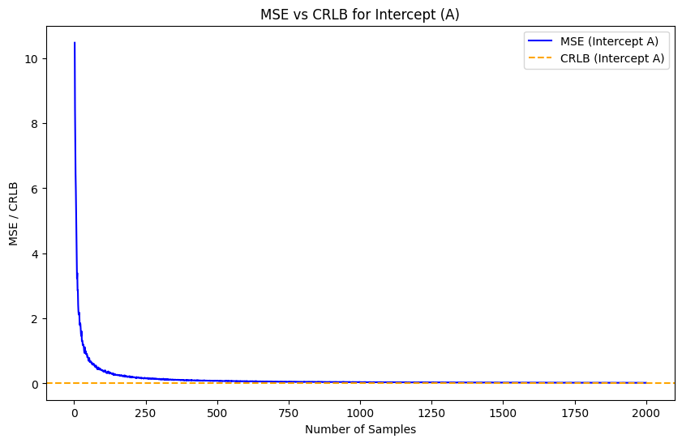
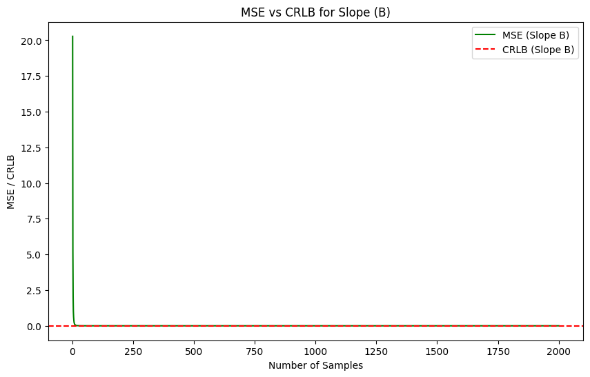

# Line Fitting: MSE vs CRLB Analysis

This project evaluates the performance of estimators for the intercept (A) and slope (B) parameters in a linear regression model. Specifically, it compares the **Mean Squared Error (MSE)** of the estimates to the **Cramér-Rao Lower Bound (CRLB)**, which provides the theoretical lower bound for the variance of any unbiased estimator. By doing so, the efficiency and consistency of the estimators are demonstrated.

## Table of Contents
- [Project Overview](#project-overview)
- [Steps and Methodology](#steps-and-methodology)
- [Results](#results)
- [Requirements](#requirements)
- [Usage](#usage)

## Project Overview

The project simulates a dataset where the true relationship between variables follows a linear model: 

$$ y = A_{\text{true}} + B_{\text{true}} \times x + \text{noise} $$

where:
- A_true = 2.0 (intercept) 
- B_true = 1.5 (slope)
- Noise is generated using a Gaussian distribution.

### Key Steps:
1. **Simulated Data Generation**: Data points are created based on the true linear model with added Gaussian noise.
2. **Parameter Estimation**: The intercept and slope are estimated from the noisy data using the `np.polyfit()` function.
3. **MSE Calculation**: The MSE of the estimates is computed by comparing them to the true values.
4. **CRLB Values**: The theoretical CRLB values for the intercept and slope are provided for comparison.
5. **Visualization**: The MSE and CRLB for both intercept and slope are plotted as a function of the number of experiments.

### Key Objectives:
- Compute MLE for slope (B) and intercept (A)
- Compute the Cramér-Rao Lower Bound (CRLB) for both parameters
- Compare the MLE estimates against the CRLB to evaluate their efficiency

## Steps and Methodology

### 1. MLE Computation

- MLE for **B** (slope) is computed using:
  
  B_MLE = [ Σ(x - x̄)(n - n̄) ] / [ Σ(n - n̄)² ]

- MLE for **A** (intercept) is computed as:

  A_MLE = x̄ - B_MLE * n̄


### 2. CRLB Computation
- The Fisher Information Matrix (FIM) is calculated based on the data.
- The Cramér-Rao Lower Bound (CRLB) is the inverse of the FIM, providing the theoretical lower bound on the variance of the estimators.

### 3. Comparison
- The MLE results for \( A \) and \( B \) are compared to their true values.
- MSE is computed for 1e4 experiments and compared with the CRLB.

## Results

<p float="left">


</p>

- **Intercept A (CRLB ≈ 0.019985)**: The MSE for the intercept decreases and approaches the CRLB as the number of experiments increases.
- **Slope B (CRLB ≈ 1.5 × 10⁻⁸)**: Similarly, the MSE for the slope decreases and stabilizes near the CRLB as more data is gathered.

This behavior demonstrates that the estimators for both A and B are **efficient** and **consistent**, with their MSE values approaching the CRLB when enough data is used.

## Requirements

To run the notebook, you will need:
- Python3
- NumPy
- Matplotlib
- Jupyter Notebook

## Usage

1. Clone the repository.
    ```bash
    git clone https://github.com/REC-1104/DET_stuff.git
    ```
2. Install the necessary Python packages.
    ```bash
    pip install -r requirements.txt
    ```
3. Open the Jupyter notebook and run the cells to reproduce the results.
    ```bash
    jupyter notebook main.ipynb
    ```
